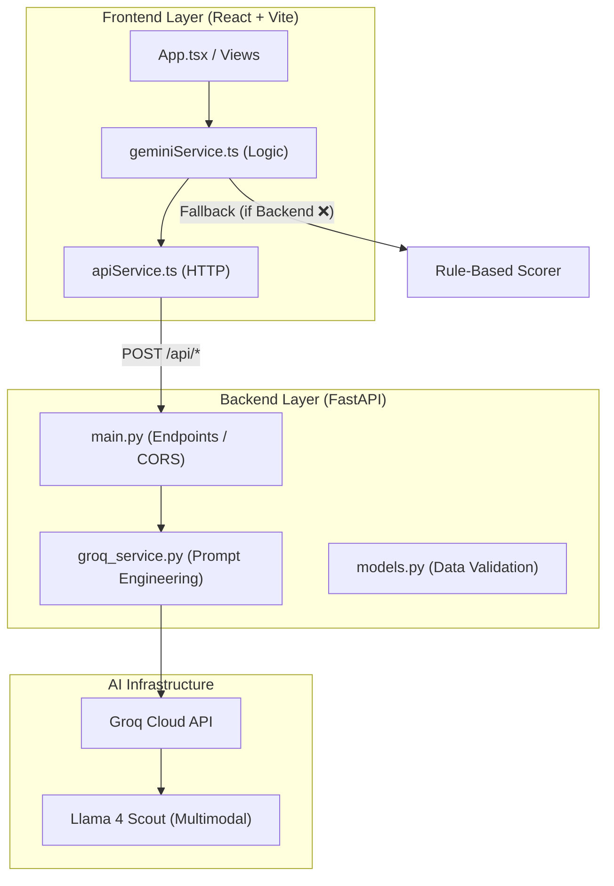

# Design Document: SanSure Platform

## Overview

SanSure is a continuous rural sanitation intelligence platform built on a dual-signal architecture that creates self-sustaining infrastructure maintenance ecosystems. The platform provides manipulation-resistant functionality signals to capital markets while delivering health consequence feedback to rural households.

### Core Architecture Principles

1. **Edge-First AI Processing**: AI scoring happens at submission time using Groq Llama 4 Scout (multimodal) with automatic fallback to rule-based scoring.
2. **Append-Only Audit Trail**: All verification events are immutably recorded in the Glass Vault SQLite database
3. **Three-Party Verification Mesh**: Mathematical independence enforced through geographic and organizational separation
4. **Dual-Signal Flow**: Financial signals flow upstream to capital providers; health impact signals flow downstream to households
5. **Progressive Enhancement**: Multi-channel access (Android app, SMS, IVR, USSD) ensures universal participation

### Technology Stack

- **Frontend**: Vite with React, TypeScript, Vanilla CSS
- **Backend**: FastAPI (Python 3.11)
- **AI Services**: Groq Cloud (`meta-llama/llama-4-scout-17b-16e-instruct` — Multimodal Scouting Model)
- **Logic Fallback**: Rule-based scoring in `geminiService.ts`
- **Visualization**: Lucide Icons, Custom CSS-based dashboard
- **Deployment**: Local dev (Vite port 3000, FastAPI port 8000)

## Architecture

### System Components



### Data Flow

1. **Verification Submission Flow**:
   - CHW uploads photo + checklist → `VerifyView.tsx`
   - `apiService.ts` sends JSON payload → FastAPI `/api/vision`
   - `groq_service.py` constructs prompt with Base64 image
   - Groq API returns hygiene analysis via Llama 4 Scout
   - Result returned to UI; fallback to rule-based scoring if API fails

2. **Collusion Adjudication Flow**:
   - Three independent submissions analyzed by `groq_service.py`
   - Backend calls Groq Collusion Adjudicator via FastAPI endpoint
   - Groq analyzes variance, consistency, and independence
   - Dashboard displays collusion risk assessment and minting decision

3. **Health Mirror Flow**:
   - Frontend requests `/api/health-narrative` from FastAPI
   - Backend processes 90-day score history and village stats
   - Backend calls Groq Health Narrator (respected elder persona)
   - Groq generates plain-language, metric-free narrative
   - Frontend displays full-screen with high-impact typography

4. **Investor Signal Flow**:
   - Frontend requests `/api/investor-signal` from FastAPI
   - Backend computes volatility and credit pricing
   - Backend calls Groq Investor Signal Generator
   - Groq returns risk rating, credit price, and investment outlook
   - Frontend renders signals for capital consumers

## Data Models


### Database Schema

#### Table: villages
```sql
CREATE TABLE villages (
  id INTEGER PRIMARY KEY AUTOINCREMENT,
  name TEXT NOT NULL,
  district TEXT NOT NULL,
  population INTEGER NOT NULL,
  official_odf_status BOOLEAN DEFAULT 0,
  official_odf_date TEXT,
  lat REAL NOT NULL,
  lng REAL NOT NULL,
  created_at TEXT DEFAULT CURRENT_TIMESTAMP
);
```

**Purpose**: Master village registry. ODF status drives discrepancy detection.

#### Table: submissions
```sql
CREATE TABLE submissions (
  id INTEGER PRIMARY KEY AUTOINCREMENT,
  village_id INTEGER NOT NULL,
  household_id TEXT NOT NULL,
  facility_id TEXT NOT NULL,
  submitter_role TEXT NOT NULL CHECK(submitter_role IN ('household', 'peer', 'auditor')),
  photo_path TEXT NOT NULL,
  checklist_door BOOLEAN NOT NULL,
  checklist_water BOOLEAN NOT NULL,
  checklist_clean BOOLEAN NOT NULL,
  checklist_toilet BOOLEAN NOT NULL,
  ai_hygiene_score INTEGER NOT NULL CHECK(ai_hygiene_score BETWEEN 0 AND 100),
  ai_confidence TEXT NOT NULL CHECK(ai_confidence IN ('high', 'medium', 'low')),
  ai_features TEXT,
  ai_discrepancies TEXT,
  spoofing_risk TEXT CHECK(spoofing_risk IN ('low', 'medium', 'high')),
  scoring_method TEXT NOT NULL CHECK(scoring_method IN ('gemini', 'groq', 'rule-based')),
  raw_ai_response TEXT,
  created_at TEXT DEFAULT CURRENT_TIMESTAMP,
  FOREIGN KEY (village_id) REFERENCES villages(id)
);
```

**Purpose**: Every verification event. Append-only. Drives all score calculations.
**Immutability**: No UPDATE or DELETE operations allowed at application layer.


#### Table: verification_cycles
```sql
CREATE TABLE verification_cycles (
  id INTEGER PRIMARY KEY AUTOINCREMENT,
  village_id INTEGER NOT NULL,
  facility_id TEXT NOT NULL,
  household_submission_id INTEGER NOT NULL,
  peer_submission_id INTEGER NOT NULL,
  auditor_submission_id INTEGER NOT NULL,
  consensus_score INTEGER CHECK(consensus_score BETWEEN 0 AND 100),
  score_variance REAL,
  collusion_risk TEXT CHECK(collusion_risk IN ('low', 'medium', 'high')),
  collusion_indicators TEXT,
  independence_confirmed BOOLEAN,
  minting_recommendation TEXT CHECK(minting_recommendation IN ('mint_token', 'hold_pending_review', 'reject_flag_escalate')),
  functionality_token_minted BOOLEAN DEFAULT 0,
  impact_credits_minted REAL DEFAULT 0,
  raw_adjudication_response TEXT,
  created_at TEXT DEFAULT CURRENT_TIMESTAMP,
  FOREIGN KEY (village_id) REFERENCES villages(id),
  FOREIGN KEY (household_submission_id) REFERENCES submissions(id),
  FOREIGN KEY (peer_submission_id) REFERENCES submissions(id),
  FOREIGN KEY (auditor_submission_id) REFERENCES submissions(id)
);
```

**Purpose**: Links 3 submissions per cycle. Records collusion result and token status.

#### Table: health_mirror_logs
```sql
CREATE TABLE health_mirror_logs (
  id INTEGER PRIMARY KEY AUTOINCREMENT,
  village_id INTEGER NOT NULL,
  period_start TEXT NOT NULL,
  period_end TEXT NOT NULL,
  avg_hygiene_score REAL NOT NULL,
  prev_period_avg_score REAL,
  estimated_cases_prevented INTEGER,
  girls_attendance_improvement REAL,
  narrative TEXT NOT NULL,
  created_at TEXT DEFAULT CURRENT_TIMESTAMP,
  FOREIGN KEY (village_id) REFERENCES villages(id)
);
```

**Purpose**: Caches Gemini narratives. Prevents redundant API calls for same period.


### Calculated Metrics

#### Volatility Index
```javascript
// Rolling 30-day standard deviation of hygiene scores
function calculateVolatilityIndex(villageId) {
  const scores = getScoresLast30Days(villageId);
  const mean = scores.reduce((a, b) => a + b) / scores.length;
  const variance = scores.reduce((sum, score) => sum + Math.pow(score - mean, 2), 0) / scores.length;
  return Math.sqrt(variance);
}
```

#### Trust Rating
```javascript
// Composite risk signal: hygiene score + mesh integrity + volatility
function calculateTrustRating(villageId) {
  const avgScore = getAvgScore90Days(villageId);
  const meshIntegrity = getMeshIntegrityRate(villageId); // % of low-collusion cycles
  const volatility = calculateVolatilityIndex(villageId);
  
  // Weighted composite (60% score, 25% mesh, 15% inverse volatility)
  const composite = (avgScore * 0.6) + (meshIntegrity * 0.25) + ((100 - volatility) * 0.15);
  
  if (composite >= 85) return 'AAA';
  if (composite >= 75) return 'AA';
  if (composite >= 65) return 'A';
  if (composite >= 55) return 'BBB';
  if (composite >= 45) return 'BB';
  if (composite >= 35) return 'B';
  if (composite >= 25) return 'CCC';
  return 'D';
}
```

#### WHO Health Impact
```javascript
// 23% diarrheal disease reduction per 10-point hygiene score improvement
function calculateCasesPrevented(villageId, currentPeriod, previousPeriod) {
  const currentAvg = getAvgScore(villageId, currentPeriod);
  const previousAvg = getAvgScore(villageId, previousPeriod);
  const scoreImprovement = currentAvg - previousAvg;
  
  const reductionRate = (scoreImprovement / 10) * 0.23;
  const baselineCases = getHistoricalCases(villageId, previousPeriod);
  
  return Math.round(baselineCases * reductionRate);
}
```

## AI Prompt Architecture


### Prompt 1: Vision Hygiene Scorer

**Service**: `backend/groq_service.py` → `run_vision_analysis()`

**Input**:
```javascript
{
  image: "base64_encoded_image",
  checklist: {
    door: true,
    water: true,
    clean: false,
    toilet: true
  },
  rubric: "Assess structural integrity, water availability, cleanliness, active usage"
}
```

**Prompt Template**:
```
You are SanSure's hygiene scoring engine. Analyze this toilet facility photo across four dimensions:

1. STRUCTURAL INTEGRITY (door present, walls intact, roof functional)
2. WATER AVAILABILITY (water source visible, container present)
3. CLEANLINESS (floor clean, no waste visible, no odor indicators)
4. ACTIVE USAGE (signs of recent use, maintained appearance)

User provided checklist:
- Door present: {checklist.door}
- Water available: {checklist.water}
- Clean floor: {checklist.clean}
- Pit cover present: {checklist.toilet}

Return ONLY this JSON (no markdown fences):
{
  "hygiene_score": 0-100,
  "confidence": "high|medium|low",
  "visual_verification": {
    "door": "confirmed|contradicted|unclear",
    "water": "confirmed|contradicted|unclear",
    "clean": "confirmed|contradicted|unclear",
    "toilet": "confirmed|contradicted|unclear"
  },
  "detected_features": ["feature1", "feature2"],
  "discrepancies": ["discrepancy if checklist contradicts photo"],
  "recommendation": "brief assessment",
  "spoofing_risk": "low|medium|high",
  "spoofing_reasoning": "why spoofing suspected or not"
}
```

**Temperature**: 0.1 (deterministic scoring)

**Output Schema**:
```typescript
interface HygieneScoreResult {
  hygiene_score: number; // 0-100
  confidence: 'high' | 'medium' | 'low';
  visual_verification: {
    door: 'confirmed' | 'contradicted' | 'unclear';
    water: 'confirmed' | 'contradicted' | 'unclear';
    clean: 'confirmed' | 'contradicted' | 'unclear';
    toilet: 'confirmed' | 'contradicted' | 'unclear';
  };
  detected_features: string[];
  discrepancies: string[];
  recommendation: string;
  spoofing_risk: 'low' | 'medium' | 'high';
  spoofing_reasoning: string;
}
```


### Prompt 2: Collusion Adjudicator

**Service**: `backend/groq_service.py` → `run_collusion_check()`

**Input**:
```javascript
{
  facility_id: "FAC_001",
  submissions: [
    {
      role: "household",
      score: 85,
      checklist: { door: true, water: true, clean: true, toilet: true },
      features: ["door present", "water container"],
      discrepancies: []
    },
    {
      role: "peer",
      score: 82,
      checklist: { door: true, water: true, clean: true, toilet: false },
      features: ["door present", "water visible"],
      discrepancies: ["toilet cover unclear"]
    },
    {
      role: "auditor",
      score: 88,
      checklist: { door: true, water: true, clean: true, toilet: true },
      features: ["well-maintained", "water source"],
      discrepancies: []
    }
  ]
}
```

**Prompt Template**:
```
You are SanSure's collusion detection engine. Three independent parties submitted assessments for facility {facility_id}:

HOUSEHOLD SUBMISSION:
Score: {submissions[0].score}
Checklist: {submissions[0].checklist}
Features: {submissions[0].features}

PEER SUBMISSION (non-adjacent):
Score: {submissions[1].score}
Checklist: {submissions[1].checklist}
Features: {submissions[1].features}

AUDITOR SUBMISSION (separate ward):
Score: {submissions[2].score}
Checklist: {submissions[2].checklist}
Features: {submissions[2].features}

Analyze for:
1. Score variance (suspicious if all identical or wildly different)
2. Checklist consistency (suspicious if all match perfectly)
3. Feature implausibility (fabricated details)
4. Statistical independence (coordinated language patterns)

Return ONLY this JSON (no markdown fences):
{
  "consensus_score": 0-100,
  "score_variance": 0-100,
  "collusion_risk": "low|medium|high",
  "collusion_indicators": ["indicator1", "indicator2"],
  "independence_confirmed": true|false,
  "reasoning": "brief explanation",
  "recommendation": "mint_token|hold_pending_review|reject_flag_escalate",
  "confidence": "high|medium|low"
}
```

**Temperature**: 0.1 (deterministic adjudication)

**Output Schema**:
```typescript
interface CollusionAdjudication {
  consensus_score: number;
  score_variance: number;
  collusion_risk: 'low' | 'medium' | 'high';
  collusion_indicators: string[];
  independence_confirmed: boolean;
  reasoning: string;
  recommendation: 'mint_token' | 'hold_pending_review' | 'reject_flag_escalate';
  confidence: 'high' | 'medium' | 'low';
}
```


### Prompt 3: Health Mirror Narrator

**Service**: `backend/groq_service.py` → `generate_health_narrative()`

**Input**:
```javascript
{
  village_name: "Rampur",
  district: "Sitapur",
  population: 450,
  avg_score_90days: 78,
  prev_period_avg: 62,
  cases_prevented: 29,
  girls_attendance_improvement: 12
}
```

**Prompt Template**:
```
You are speaking to the community of {village_name} in {district} district. Population: {population} people.

Over the past 90 days, your village maintained clean toilets. The improvement prevented an estimated {cases_prevented} cases of diarrheal illness compared to the same period last year. Girls' school attendance improved by {girls_attendance_improvement}%.

Write ONE warm paragraph (4-6 sentences) explaining this impact. Speak as a respected elder at a village meeting. Use plain language. Never use these words: data, score, metric, percentage, coefficient, algorithm, system.

Focus on: protection of children, health of families, pride in community achievement, connection between clean toilets and healthy children.
```

**Temperature**: 0.7 (creative, warm tone)

**Output**: Plain text paragraph (no JSON)

**Example Output**:
```
Your village kept toilets clean for 90 days. Illness cases this quarter: 12. Same period last year: 41. You protected 29 people. More girls attended school because they stayed healthy. Your families are stronger because you maintained what you built. This is the work that saves lives.
```


### Prompt 4: Investor Signal Generator

**Service**: `backend/groq_service.py` → `generate_investor_signal()`

**Input**:
```javascript
{
  village_name: "Rampur",
  scores_90days: [65, 68, 72, 75, 78, 80, 82, 85, 83, 84],
  avg_score: 77.2,
  std_dev: 6.8,
  trend: "improving"
}
```

**Prompt Template**:
```
You are SanSure's investment signal generator. Analyze this 90-day hygiene score history for {village_name}:

Scores: {scores_90days}
Average: {avg_score}
Standard Deviation: {std_dev}
Trend: {trend}

Generate investment signals:
1. Credit Price (INR): ₹80-500 based on score quality and stability
2. Volatility Index: 0-100 (higher = more risk)
3. Risk Rating: AAA to D
4. Trend: strongly_improving|improving|stable|declining|strongly_declining
5. Investment Signal: One sentence (≤15 words) for fund managers
6. Disbursement Ready: true if safe to release funds
7. 30-day Forecast: improving|stable|at_risk

Return ONLY this JSON (no markdown fences):
{
  "credit_price_inr": 80-500,
  "volatility_index": 0-100,
  "risk_rating": "AAA|AA|A|BBB|BB|B|CCC|D",
  "trend": "strongly_improving|improving|stable|declining|strongly_declining",
  "investment_signal": "max 15 words",
  "disbursement_ready": true|false,
  "30_day_forecast": "improving|stable|at_risk"
}
```

**Temperature**: 0.1 (deterministic financial signals)

**Output Schema**:
```typescript
interface InvestorSignal {
  credit_price_inr: number; // 80-500
  volatility_index: number; // 0-100
  risk_rating: 'AAA' | 'AA' | 'A' | 'BBB' | 'BB' | 'B' | 'CCC' | 'D';
  trend: 'strongly_improving' | 'improving' | 'stable' | 'declining' | 'strongly_declining';
  investment_signal: string; // ≤15 words
  disbursement_ready: boolean;
  '30_day_forecast': 'improving' | 'stable' | 'at_risk';
}
```

## API Specifications


### Backend REST API Endpoints

#### POST /api/vision
Submit toilet verification via JSON with Base64 image and checklist.

**Request**:
```json
{
  "base64_image": "...",
  "checklist": {
    "door": true,
    "water": true,
    "clean": true,
    "toilet": true
  }
}
```

**Response**:
```json
{
  "submission_id": 123,
  "hygiene_score": 75,
  "confidence": "high",
  "visual_verification": {
    "door": "confirmed",
    "water": "confirmed",
    "clean": "contradicted",
    "toilet": "confirmed"
  },
  "discrepancies": ["Checklist marked clean=false, photo shows clean floor"],
  "spoofing_risk": "low",
  "scoring_method": "groq"
}
```

#### GET /api/verify/submission/:id
Retrieve submission details.

**Response**:
```json
{
  "id": 123,
  "village_id": 1,
  "household_id": "HH_001",
  "hygiene_score": 75,
  "confidence": "high",
  "created_at": "2024-01-15T10:30:00Z"
}
```

#### GET /api/dashboard/villages
List all villages with current trust ratings.

**Response**:
```json
{
  "villages": [
    {
      "id": 1,
      "name": "Rampur",
      "district": "Sitapur",
      "lat": 27.5,
      "lng": 80.5,
      "trust_rating": "AA",
      "current_score": 78,
      "volatility_index": 6.8,
      "official_odf_status": true
    }
  ]
}
```


#### GET /api/dashboard/village/:id/scores
Get 90-day score history for trend chart.

**Response**:
```json
{
  "village_id": 1,
  "scores": [
    { "date": "2024-01-01", "score": 65 },
    { "date": "2024-01-02", "score": 68 },
    { "date": "2024-01-03", "score": 72 }
  ],
  "avg_score": 77.2,
  "volatility_index": 6.8
}
```

#### GET /api/dashboard/village/:id/collusion
Get recent collusion adjudication results.

**Response**:
```json
{
  "village_id": 1,
  "recent_cycles": [
    {
      "cycle_id": 45,
      "facility_id": "FAC_001",
      "consensus_score": 85,
      "collusion_risk": "low",
      "independence_confirmed": true,
      "created_at": "2024-01-15T10:30:00Z"
    }
  ]
}
```

#### GET /api/mirror/village/:id
Get Health Mirror narrative and metrics.

**Response**:
```json
{
  "village_id": 1,
  "village_name": "Rampur",
  "narrative": "Your village kept toilets clean for 90 days...",
  "cases_prevented": 29,
  "year_on_year_change": -70.7,
  "girls_attendance_improvement": 12,
  "period_start": "2024-01-01",
  "period_end": "2024-03-31"
}
```

#### GET /api/investor/village/:id/signal
Get investment signals for capital consumers.

**Response**:
```json
{
  "village_id": 1,
  "village_name": "Rampur",
  "credit_price_inr": 385,
  "volatility_index": 6.8,
  "risk_rating": "AA",
  "trend": "improving",
  "investment_signal": "Strong upward trajectory with low volatility. Recommend disbursement.",
  "disbursement_ready": true,
  "30_day_forecast": "improving"
}
```

## Component Design


### Frontend Components

#### HygieneScoreCard.tsx
Displays hygiene score with confidence level and per-dimension breakdown.

**Props**:
```typescript
interface HygieneScoreCardProps {
  score: number;
  confidence: 'high' | 'medium' | 'low';
  visualVerification: {
    door: 'confirmed' | 'contradicted' | 'unclear';
    water: 'confirmed' | 'contradicted' | 'unclear';
    clean: 'confirmed' | 'contradicted' | 'unclear';
    toilet: 'confirmed' | 'contradicted' | 'unclear';
  };
}
```

**Layout**:
- Large score number at top (0-100)
- Confidence badge below score
- 2x2 grid of dimension cards with icons
- Color coding: green (confirmed), red (contradicted), yellow (unclear)

#### VillageMap.tsx
Leaflet.js map with village clusters color-coded by trust rating.

**Props**:
```typescript
interface VillageMapProps {
  villages: Array<{
    id: number;
    name: string;
    lat: number;
    lng: number;
    trust_rating: string;
    current_score: number;
  }>;
  onVillageSelect: (villageId: number) => void;
}
```

**Features**:
- Marker colors based on trust rating (green=AAA/AA, yellow=A/BBB, red=BB/B/CCC/D)
- Tooltip on hover showing village name + score
- Click to select village and show detail panel
- Legend in top-right corner

#### DiscrepancyAlert.tsx
Alert banner for ODF discrepancies and scoring issues.

**Props**:
```typescript
interface DiscrepancyAlertProps {
  type: 'odf_discrepancy' | 'scoring_discrepancy' | 'spoofing_risk';
  message: string;
  severity: 'low' | 'medium' | 'high';
}
```

**Layout**:
- Red banner at top of screen
- Icon + message text
- Severity indicator (color intensity)


#### HealthMirrorDisplay.tsx
Full-screen health impact display with large typography.

**Props**:
```typescript
interface HealthMirrorDisplayProps {
  villageName: string;
  narrative: string;
  casesPrevented: number;
  yearOnYearChange: number;
  girlsAttendanceImprovement: number;
}
```

**Layout**:
- Village name header (48pt, top)
- Main narrative paragraph (24pt, center, max-width 800px)
- Three-column metric cards at bottom:
  - Cases Prevented (large number + icon)
  - Year-on-Year Change (percentage + trend arrow)
  - Girls Attendance (percentage + school icon)
- Responsive: portrait (mobile) and landscape (projector)
- Color scheme: greens and blues (warm, encouraging)

#### CollisionReport.tsx
Displays collusion adjudication results for verification cycles.

**Props**:
```typescript
interface CollisionReportProps {
  cycles: Array<{
    cycle_id: number;
    facility_id: string;
    consensus_score: number;
    collusion_risk: 'low' | 'medium' | 'high';
    independence_confirmed: boolean;
    created_at: string;
  }>;
}
```

**Layout**:
- Scrollable list of recent cycles
- Each item shows: facility ID, consensus score, risk badge
- Color coding: green (low), yellow (medium), red (high)
- Timestamp for each cycle

#### InvestorSignal.tsx
Investment signal dashboard for capital consumers.

**Props**:
```typescript
interface InvestorSignalProps {
  creditPrice: number;
  volatilityIndex: number;
  riskRating: string;
  trend: string;
  investmentSignal: string;
  disbursementReady: boolean;
  forecast: string;
}
```

**Layout**:
- Grid of metric cards (2x3 or 3x2 depending on screen)
- Credit price prominently displayed (₹ symbol)
- Risk rating with color coding
- Investment signal as highlighted text box
- Disbursement ready as green/red indicator
- 30-day forecast with trend arrow

## Fallback System Design


### AI Service Fallback Chain

```javascript
// backend/services/gemini.js
async function scoreToiletPhoto(image, checklist) {
  try {
    // Primary: Gemini 3 Pro Preview
    return await callGeminiVision(image, checklist);
  } catch (error) {
    if (error.code === 'QUOTA_EXCEEDED') {
      console.log('Gemini quota exhausted, falling back to Groq');
      try {
        // Fallback 1: Groq Llama 4 Maverick
        return await callGroqVision(image, checklist);
      } catch (groqError) {
        console.log('Groq unavailable, falling back to rule-based');
        // Fallback 2: Rule-based scorer
        return ruleBasedScore(checklist);
      }
    }
    throw error;
  }
}
```

### Rule-Based Scoring Algorithm

```javascript
// backend/services/scorer.js
function ruleBasedScore(checklist) {
  let score = 50; // Base score
  
  // Each checklist item worth 12.5 points
  if (checklist.door) score += 12.5;
  if (checklist.water) score += 12.5;
  if (checklist.clean) score += 12.5;
  if (checklist.toilet) score += 12.5;
  
  return {
    hygiene_score: Math.round(score),
    confidence: 'low', // Rule-based always low confidence
    visual_verification: {
      door: checklist.door ? 'confirmed' : 'contradicted',
      water: checklist.water ? 'confirmed' : 'contradicted',
      clean: checklist.clean ? 'confirmed' : 'contradicted',
      toilet: checklist.toilet ? 'confirmed' : 'contradicted'
    },
    detected_features: [],
    discrepancies: [],
    recommendation: 'Rule-based scoring used due to AI unavailability',
    spoofing_risk: 'unclear',
    spoofing_reasoning: 'Cannot assess without visual analysis'
  };
}
```

### WHO Health Coefficient Implementation

```javascript
// backend/services/scorer.js
function calculateWHOImpact(currentScore, previousScore, baselineCases) {
  const WHO_COEFFICIENT = 0.23; // 23% reduction per 10-point improvement
  const scoreImprovement = currentScore - previousScore;
  const reductionRate = (scoreImprovement / 10) * WHO_COEFFICIENT;
  const casesPrevented = Math.round(baselineCases * reductionRate);
  
  return {
    cases_prevented: Math.max(0, casesPrevented),
    reduction_rate: reductionRate,
    score_improvement: scoreImprovement
  };
}
```

## Correctness Properties


### Property 1: Hygiene Score Bounds
**Validates: Requirements 1.2**

For all submissions, the hygiene score must be between 0 and 100 inclusive.

```javascript
// Property-based test
property('hygiene_score_bounds', 'submission', (submission) => {
  return submission.ai_hygiene_score >= 0 && 
         submission.ai_hygiene_score <= 100;
});
```

### Property 2: Append-Only Immutability
**Validates: Requirements 3.4, 3.8**

Once a record is inserted into the Glass Vault, it cannot be modified or deleted.

```javascript
// Property-based test
property('glass_vault_immutability', 'submission_id', async (id) => {
  const original = await db.getSubmission(id);
  const attemptUpdate = await db.updateSubmission(id, { ai_hygiene_score: 99 });
  const afterAttempt = await db.getSubmission(id);
  
  return attemptUpdate === false && 
         original.ai_hygiene_score === afterAttempt.ai_hygiene_score;
});
```

### Property 3: Three-Party Independence
**Validates: Requirements 2.1**

For any verification cycle, the three submitters must be mathematically independent (different roles, non-adjacent geography, separate wards).

```javascript
// Property-based test
property('three_party_independence', 'verification_cycle', (cycle) => {
  const household = getSubmission(cycle.household_submission_id);
  const peer = getSubmission(cycle.peer_submission_id);
  const auditor = getSubmission(cycle.auditor_submission_id);
  
  const rolesUnique = new Set([household.submitter_role, peer.submitter_role, auditor.submitter_role]).size === 3;
  const householdsUnique = new Set([household.household_id, peer.household_id, auditor.household_id]).size === 3;
  
  return rolesUnique && householdsUnique;
});
```

### Property 4: Volatility Index Calculation
**Validates: Requirements 3.5**

The Volatility Index must equal the standard deviation of the last 30 days of hygiene scores.

```javascript
// Property-based test
property('volatility_index_correctness', 'village_id', (villageId) => {
  const scores = getScoresLast30Days(villageId);
  const calculatedVolatility = calculateVolatilityIndex(villageId);
  const expectedStdDev = standardDeviation(scores);
  
  return Math.abs(calculatedVolatility - expectedStdDev) < 0.01;
});
```


### Property 5: WHO Coefficient Application
**Validates: Requirements 5.2**

Health impact calculation must apply the WHO coefficient (23% reduction per 10-point improvement) correctly.

```javascript
// Property-based test
property('who_coefficient_correctness', 'score_improvement, baseline_cases', (improvement, baseline) => {
  const result = calculateWHOImpact(70 + improvement, 70, baseline);
  const expectedReduction = (improvement / 10) * 0.23;
  const expectedCases = Math.round(baseline * expectedReduction);
  
  return result.cases_prevented === expectedCases;
});
```

### Property 6: Collusion Risk Consistency
**Validates: Requirements 2.7, 2.9**

When collusion risk is high, Impact_Credit minting must be prevented.

```javascript
// Property-based test
property('collusion_prevents_minting', 'verification_cycle', (cycle) => {
  if (cycle.collusion_risk === 'high') {
    return cycle.functionality_token_minted === false;
  }
  return true; // No constraint for low/medium risk
});
```

### Property 7: Fallback Scoring Consistency
**Validates: Requirements 12.8**

All three scoring methods (Gemini, Groq, rule-based) must produce scores within ±10 points for equivalent inputs.

```javascript
// Property-based test
property('fallback_consistency', 'checklist', async (checklist) => {
  const geminiScore = await scoreWithGemini(mockImage, checklist);
  const groqScore = await scoreWithGroq(mockImage, checklist);
  const ruleScore = ruleBasedScore(checklist);
  
  const maxDiff = Math.max(
    Math.abs(geminiScore.hygiene_score - groqScore.hygiene_score),
    Math.abs(geminiScore.hygiene_score - ruleScore.hygiene_score),
    Math.abs(groqScore.hygiene_score - ruleScore.hygiene_score)
  );
  
  return maxDiff <= 10;
});
```

### Property 8: Credit Price Bounds
**Validates: Requirements 4.3**

Impact Credit price must be between ₹80 and ₹500.

```javascript
// Property-based test
property('credit_price_bounds', 'village_id', async (villageId) => {
  const signal = await generateInvestorSignal(villageId);
  return signal.credit_price_inr >= 80 && signal.credit_price_inr <= 500;
});
```

## Security Considerations


### Photo Upload Security

1. **File Type Validation**: Only accept JPEG, PNG, WebP
2. **File Size Limit**: Maximum 10MB per upload
3. **Virus Scanning**: Deferred to production (not in MVP)
4. **Storage Isolation**: Photos stored in `/uploads` with unique filenames
5. **Path Traversal Prevention**: Sanitize all file paths

```javascript
// backend/routes/verify.js
const multer = require('multer');
const path = require('path');

const storage = multer.diskStorage({
  destination: './uploads/',
  filename: (req, file, cb) => {
    const uniqueName = `${Date.now()}-${Math.random().toString(36).substr(2, 9)}${path.extname(file.originalname)}`;
    cb(null, uniqueName);
  }
});

const upload = multer({
  storage: storage,
  limits: { fileSize: 10 * 1024 * 1024 }, // 10MB
  fileFilter: (req, file, cb) => {
    const allowedTypes = /jpeg|jpg|png|webp/;
    const extname = allowedTypes.test(path.extname(file.originalname).toLowerCase());
    const mimetype = allowedTypes.test(file.mimetype);
    
    if (extname && mimetype) {
      cb(null, true);
    } else {
      cb(new Error('Only image files allowed'));
    }
  }
});
```

### API Authentication

For MVP: Simple API key authentication
For Production: OAuth 2.0 + JWT tokens

```javascript
// backend/middleware/auth.js
function authenticateAPIKey(req, res, next) {
  const apiKey = req.headers['x-api-key'];
  
  if (!apiKey || !isValidAPIKey(apiKey)) {
    return res.status(401).json({ error: 'Unauthorized' });
  }
  
  next();
}

// Apply to investor endpoints
app.use('/api/investor', authenticateAPIKey);
```

### Database Security

1. **Prepared Statements**: Use parameterized queries to prevent SQL injection
2. **Read-Only Access**: Catoiletal consumers get read-only database views
3. **Backup Strategy**: Daily SQLite backups (deferred to production)
4. **Encryption at Rest**: Deferred to production

```javascript
// backend/db/database.js
const db = require('better-sqlite3')('sansure.db');

// Prepared statement example
const insertSubmission = db.prepare(`
  INSERT INTO submissions (village_id, household_id, ai_hygiene_score, ...)
  VALUES (?, ?, ?, ...)
`);

// Prevent UPDATE/DELETE at application layer
// No update or delete methods exposed
```

## Performance Optimization


### Caching Strategy

1. **Health Mirror Narratives**: Cache for 24 hours (stored in health_mirror_logs)
2. **Investor Signals**: Cache for 1 hour (recalculate on demand)
3. **Village Trust Ratings**: Cache for 30 minutes
4. **90-Day Score Trends**: Cache for 1 hour

```javascript
// Simple in-memory cache for MVP
const cache = new Map();

function getCached(key, ttl, generator) {
  const cached = cache.get(key);
  if (cached && Date.now() - cached.timestamp < ttl) {
    return cached.value;
  }
  
  const value = generator();
  cache.set(key, { value, timestamp: Date.now() });
  return value;
}

// Usage
app.get('/api/mirror/village/:id', async (req, res) => {
  const narrative = getCached(
    `mirror_${req.params.id}`,
    24 * 60 * 60 * 1000, // 24 hours
    () => generateHealthNarrative(req.params.id)
  );
  res.json(narrative);
});
```

### Database Indexing

```sql
-- Optimize common queries
CREATE INDEX idx_submissions_village_created ON submissions(village_id, created_at DESC);
CREATE INDEX idx_submissions_facility ON submissions(facility_id);
CREATE INDEX idx_verification_cycles_village ON verification_cycles(village_id);
CREATE INDEX idx_health_mirror_village_period ON health_mirror_logs(village_id, period_start, period_end);
```

### AI API Rate Limiting

```javascript
// backend/services/gemini.js
const rateLimit = {
  requests: 0,
  resetTime: Date.now() + 60000 // 1 minute window
};

async function callGeminiAPI(prompt) {
  if (Date.now() > rateLimit.resetTime) {
    rateLimit.requests = 0;
    rateLimit.resetTime = Date.now() + 60000;
  }
  
  if (rateLimit.requests >= 60) { // 60 requests per minute
    throw new Error('QUOTA_EXCEEDED');
  }
  
  rateLimit.requests++;
  return await geminiClient.generate(prompt);
}
```

## Testing Strategy


### Unit Tests

**Framework**: Jest or Vitest

**Coverage Areas**:
1. Rule-based scoring algorithm
2. WHO coefficient calculation
3. Volatility Index calculation
4. Trust Rating calculation
5. API endpoint responses
6. Database query functions

```javascript
// Example: scorer.test.js
describe('Rule-based Scorer', () => {
  test('all checklist items true returns 100', () => {
    const result = ruleBasedScore({
      door: true,
      water: true,
      clean: true,
      toilet: true
    });
    expect(result.hygiene_score).toBe(100);
  });
  
  test('no checklist items returns 50', () => {
    const result = ruleBasedScore({
      door: false,
      water: false,
      clean: false,
      toilet: false
    });
    expect(result.hygiene_score).toBe(50);
  });
});
```

### Property-Based Tests

**Framework**: fast-check (JavaScript)

**Test Properties**:
1. Hygiene score bounds (0-100)
2. Append-only immutability
3. Three-party independence
4. Volatility Index correctness
5. WHO coefficient application
6. Collusion risk consistency
7. Fallback scoring consistency
8. Credit price bounds

```javascript
// Example: properties.test.js
import fc from 'fast-check';

describe('Property-Based Tests', () => {
  test('hygiene scores always between 0 and 100', () => {
    fc.assert(
      fc.property(
        fc.record({
          door: fc.boolean(),
          water: fc.boolean(),
          clean: fc.boolean(),
          toilet: fc.boolean()
        }),
        (checklist) => {
          const result = ruleBasedScore(checklist);
          return result.hygiene_score >= 0 && result.hygiene_score <= 100;
        }
      )
    );
  });
});
```

### Integration Tests

**Coverage Areas**:
1. Photo upload → AI scoring → database storage
2. Three submissions → collusion adjudication → token minting
3. Score history → Health Mirror narrative generation
4. Score history → Investor signal generation
5. Fallback chain (Gemini → Groq → rule-based)

## Deployment Configuration


### Environment Variables

**Backend (.env)**:
```bash
# Server
PORT=3001
NODE_ENV=development

# Database
DATABASE_PATH=./sansure.db

# AI Services
GEMINI_API_KEY=your_gemini_api_key
GROQ_API_KEY=your_groq_api_key

# File Upload
UPLOAD_DIR=./uploads
MAX_FILE_SIZE=10485760

# API Authentication
API_KEY_INVESTOR=your_investor_api_key
```

**Frontend (.env.local)**:
```bash
# Backend API
NEXT_PUBLIC_API_URL=http://localhost:3001/api

# Map Configuration
NEXT_PUBLIC_MAP_CENTER_LAT=27.5
NEXT_PUBLIC_MAP_CENTER_LNG=80.5
NEXT_PUBLIC_MAP_ZOOM=8
```

### Development Setup

```bash
# Backend
cd backend
npm install
npm run seed  # Seed database with mock data
npm run dev   # Start Express server on port 3001

# Frontend
cd frontend
npm install
npm run dev   # Start Next.js on port 3000
```

### Production Considerations (Deferred)

1. **Containerization**: Docker + Docker Compose
2. **Database**: Migrate to PostgreSQL for production scale
3. **File Storage**: Move to S3 or equivalent object storage
4. **CDN**: CloudFront for static assets
5. **Load Balancing**: Multiple backend instances
6. **Monitoring**: Application performance monitoring (APM)
7. **Logging**: Centralized logging (ELK stack)
8. **SSL/TLS**: HTTPS for all endpoints
9. **Database Backups**: Automated daily backups with retention
10. **Disaster Recovery**: Multi-region deployment

## Success Metrics


### Technical Success Criteria

1. **AI Scoring Accuracy**: Gemini Vision scores agree with independent field assessments ≥80%
2. **Collusion Detection**: AI identifies seeded false submissions ≥75% accuracy
3. **API Response Time**: All endpoints respond within 2 seconds for cached data
4. **Fallback Reliability**: System continues operating during AI service outages
5. **Data Integrity**: Zero unauthorized modifications to Glass Vault records
6. **Score Consistency**: Fallback methods produce scores within ±10 points

### User Experience Metrics

1. **Health Mirror Comprehension**: ≥80% of households correctly interpret output without assistance
2. **Verification Completion Time**: CHW completes submission in <3 minutes
3. **Dashboard Load Time**: Village Trust Dashboard loads in <2 seconds
4. **Mobile Responsiveness**: All screens functional on devices ≥360px width

### Business Impact Metrics

1. **Health Correlation Accuracy**: Predictions match epidemiological audits ≥70%
2. **Investment Signal Predictiveness**: Credit prices predict audit outcomes ≥65%, 10+ days advance
3. **Catoiletal Integration**: ≥1 partner deploys funds via automated API trigger
4. **Community Engagement**: Monthly Health Mirror views per village ≥4

## Implementation Phases

### Phase 1: Backend Foundation (Hour 1)
- SQLite database setup with schema
- Seed script with 5 mock villages + 90-day scores
- Express server with health check endpoint
- Gemini API integration test
- Basic error handling and logging

### Phase 2: Verification Submission (Hour 2)
- Photo upload endpoint with Multer
- Gemini Vision scoring integration
- Fallback chain implementation (Gemini → Groq → rule-based)
- Database insertion for submissions
- Frontend verification form with photo upload
- Results display with HygieneScoreCard component

### Phase 3: Dashboard Part 1 (Hour 3)
- Village list endpoint
- 90-day score history endpoint
- Frontend dashboard page with village selection
- Recharts trend graph component
- Volatility Index calculation and display
- Metric cards for key indicators


### Phase 4: Dashboard Part 2 + Collusion (Hour 4)
- Leaflet.js map integration
- Village markers with color coding
- Map legend and tooltips
- ODF discrepancy detection logic
- Collusion adjudication endpoint
- Three-party verification cycle creation
- Gemini collusion adjudicator integration
- CollisionReport component
- DiscrepancyAlert component

### Phase 5: Health Mirror + Investor Signal (Hour 5)
- WHO coefficient calculation
- Health Mirror narrative endpoint
- Gemini Health Narrator integration
- Narrative caching in health_mirror_logs
- HealthMirrorDisplay component with full-screen layout
- Investor signal endpoint
- Gemini Investor Signal Generator integration
- InvestorSignal component
- REST API documentation

### Phase 6: Polish + Demo (Hour 6)
- Landing page with role selector
- Navigation between screens
- Error handling and user feedback
- Loading states and progress indicators
- Responsive layout testing
- Fallback testing (simulate API failures)
- End-to-end demo path verification
- Performance optimization
- Documentation updates

## Risk Mitigation

### Technical Risks

1. **AI API Quota Exhaustion**
   - Mitigation: Three-tier fallback (Gemini → Groq → rule-based)
   - Monitoring: Track API usage and predict exhaustion 24h advance

2. **Photo Spoofing**
   - Mitigation: AI spoofing risk detection in Gemini Vision prompt
   - Future: Implement liveness detection (4-second video pan)

3. **Database Corruption**
   - Mitigation: SQLite WAL mode for crash recovery
   - Future: Automated backups with retention policy

4. **Collusion False Negatives**
   - Mitigation: Conservative adjudication (err on side of flagging)
   - Monitoring: Manual review of high-value cycles

### Operational Risks

1. **Low Rural Connectivity**
   - Mitigation: Offline queue for submissions (deferred to production)
   - Alternative: SMS/IVR channels (deferred to production)

2. **Low Digital Literacy**
   - Mitigation: Large typography, icons, plain language
   - Training: CHW onboarding program (deferred)

3. **Catoiletal Consumer Trust**
   - Mitigation: Transparent Glass Vault audit trail
   - Validation: Independent field audits to verify AI accuracy

## Conclusion

This design document provides a comprehensive technical blueprint for the SanSure MVP. The architecture prioritizes:

1. **Reliability**: Three-tier AI fallback ensures continuous operation
2. **Integrity**: Append-only Glass Vault prevents data manipulation
3. **Transparency**: All verification events auditable by capital consumers
4. **Accessibility**: Multi-channel access for rural households
5. **Scalability**: Modular design supports future enhancements

The 6-hour implementation timeline focuses on core demo functionality while deferring production features (SMS/IVR, payment integration, advanced security) to post-MVP phases.
